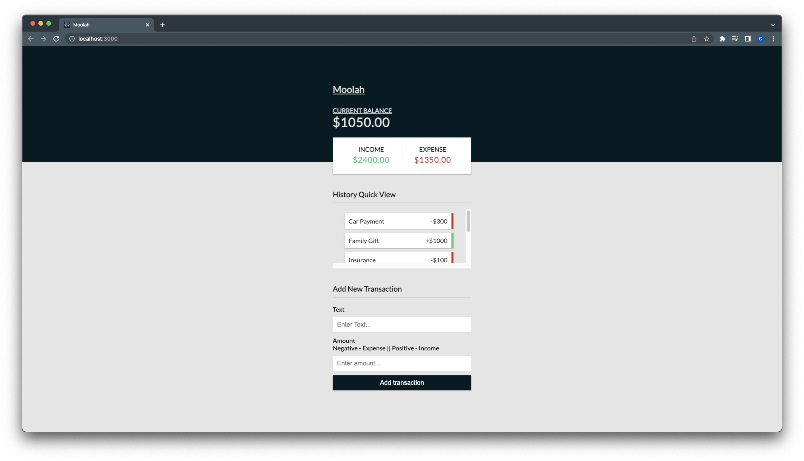

# Moolah - MERN Application

Fullstack application allowing users to add and delete transactions. An efficient way to keep track of daily transactions.

---

## License


---

## Table of Contents:

- [License](#license)
- [Technologies](#technologies)
- [Installation](#installation)
- [Application](#application)
- [Contact](#contact)

---

## Technologies:

- Node
- mongoDB
- React
- Express

---

## Installation

- This is a Node.Js based application. If not using the Heroku link please follow the instructions to get the application running on your server.

1. Clone repo from GitHub

   ```
   gh repo clone geoescobar/money-manager
   ```

2. Download dependencies at root level in the integrated terminal

   ```
   npm install
   ```

3. Download dependencies in the client folder

   ```
   cd client
   npm install
   cd ..
   ```

4. In the .env file, update the required information to connect to DB

   ```diff
   NODE_ENV=development
   PORT= root
   -MONGO_URI=  YOUR URI HERE
   ```

5. Launch application

   ```
   npm run dev
   ```

---

## Application


#### [Demo](https://drive.google.com/file/d/1kYa8TMb4O3QN5I9GNmV_7wjN3WR4r7XE/view)




---

## Contact

#### If you have any questions about this repo or want to send a message my contact info is below!

- https://github.com/geoescobar
- geo.escobar214@gmail.com
